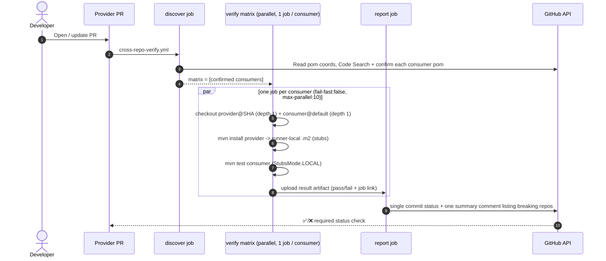

# demo-contract-provider

A minimal Spring Boot HTTP **provider** demonstrating automated cross-repository
contract-impact verification with **Spring Cloud Contract** (Groovy DSL), **no
broker** and **no artifact publishing**.

Endpoint:

```
POST /api/greetings {"name":"Team"}  ->  200 {"message":"Hello Team"}
```

- Java 21, Maven, Spring Boot 3.4.1, Spring Cloud 2024.0.0 (Contract 4.2.0).
- Static demo version: `1.0.0-SNAPSHOT` (never bumped per-PR).
- Groovy contract in `src/test/resources/contracts/greetings/`.
- Producer contract tests are **generated** from that contract; the `*-stubs.jar`
  is installed **only** into the runner-local Maven repository.

## What the demo proves / does not prove

**Proves:** When a provider PR changes the contract-relevant behaviour (e.g.
renames the JSON request field or the `message` response field), an automated
GitHub Actions flow builds the exact PR commit and runs the **real consumer
tests** against the resulting stubs, reporting pass/fail back on the PR - with
no developer-run Maven commands after the PR is raised, and no artifacts
published anywhere.

**Does not prove:** That every consumer everywhere is discovered (discovery is
best-effort - see below), nor that runtime concerns beyond the contract (auth,
performance, Kafka, etc.) are safe. Installing a JAR and running a build is *not*
verification; the workflows explicitly run the changed consumer's tests.

## Architecture / PR verification flow



> Fan-out, not a single mega-job: each matrix job checks out only **two** repos
> (provider@SHA + one consumer) with `fetch-depth: 1`, so wall-clock time is
> roughly one build long regardless of consumer count (bounded by `max-parallel`).

## Local test instructions

```bash
# Build, generate + verify contract tests, install stubs into local .m2
mvn clean install

# Confirm the generated producer contract test exists
find target/generated-test-sources -name '*.java'

# Confirm the stubs jar was installed locally (nothing is published remotely)
find ~/.m2/repository/com/example/demo/demo-contract-provider -name '*stubs*.jar'
```

To use an ephemeral, runner-local repository (as CI does):

```bash
mvn clean install -Dmaven.repo.local=/tmp/m2
```

## Breaking-change demonstration

Rename the contract-relevant field and watch consumer verification fail:

1. In `src/main/java/com/example/provider/GreetingResponse.java` rename
   `message` → `text`.
2. In `src/test/resources/contracts/greetings/shouldReturnGreeting.groovy`
   change `message:` → `text:` and update the provider's own tests.
3. `mvn clean install` - stubs now emit `{"text":...}` while the consumer still
   expects `{"message":...}`.
4. The consumer's `GreetingClientStubRunnerTest` fails until the consumer client
   and DTOs are updated to match.

Restore the field to return to green.

## Workflows

| File | Trigger | Purpose |
|------|---------|---------|
| `pr-build.yml` | `pull_request`, `workflow_dispatch` | Own build + contract verification; installs stubs into runner-local `.m2`. |
| `cross-repo-verify.yml` | `pull_request`, `workflow_dispatch` | `discover` downstream consumers → `verify` matrix (parallel, one job per consumer, each runs that consumer's tests against provider@SHA stubs) → `report` single status + summary comment. |

`cross-repo-verify.yml` accepts a `workflow_dispatch` input (`consumer_repo`) to
verify a single consumer manually for demos/troubleshooting.

> **Alternative (cross-org / partner-owned):** if verification must execute in
> the consumer's own repo instead of in-repo, replace the matrix with a
> `repository_dispatch` to the consumer (payload = provider SHA) and a receiver
> workflow on the consumer's default branch. Same steps, extra hop; needs
> `Contents: write` to create the dispatch. The in-repo matrix above is used
> here because it is faster and self-contained for the demo.

## GitHub App setup (the realistic identity)

The workflows authenticate as a **GitHub App** — an independent bot actor owned
by the account, *not* tied to any individual developer. This is the production
design: it survives people leaving, posts comments/statuses as the system, and
its token is minted per-run and short-lived. A fine-grained **PAT** remains
documented only as a demo-only fallback (see bottom of this section).

Why an App rather than a personal PAT:

- A PAT carries **one person's** identity and access; if they leave or rotate it,
  the automation breaks. An App is the account's own service identity.
- App tokens are minted per job by `actions/create-github-app-token`, scoped to
  exactly the repos each job needs, and expire in ~1 hour.
- A PR opened by the App token (the nightly graph generator) **triggers** other
  workflows; a PR opened by the built-in `GITHUB_TOKEN` does not.

### Required GitHub App permissions (verified against current GitHub REST docs)

All are **repository** permissions; install the App on **both** demo repos.

| Permission | Access | Why | Endpoint that requires it |
|------------|--------|-----|---------------------------|
| **Metadata** | Read | Mandatory baseline for every App. | — |
| **Contents** | Read and write | *Read*: check out this repo + the partner repo at the PR SHA, read `pom.xml`, run Code Search. *Write*: the nightly generator pushes its `chore/service-graph` branch. | [Get content](https://docs.github.com/en/rest/repos/contents) (read) / [Create/update file & push](https://docs.github.com/en/rest/repos/contents) (write) |
| **Pull requests** | Read and write | Create/update the single summary comment on the PR; the generator opens its PR. | [Create an issue comment](https://docs.github.com/en/rest/issues/comments) (a PR is an issue; covered by Pull requests: write) |
| **Commit statuses** | Read and write | Post the `contract-verification` status that branch protection requires. | [Create a commit status](https://docs.github.com/en/rest/commits/statuses) |

> Not needed: **Checks** (we use commit statuses, not the Checks API),
> **Issues** (we only comment on PRs, covered by Pull requests: write),
> **Administration**, **Actions**. `repository_dispatch` is *not* used, so no
> extra `Contents: write` beyond the generator is required for dispatch.

### Create + install the App (one time)

1. **Settings → Developer settings → GitHub Apps → New GitHub App.**
   ("Developer settings" is just where GitHub keeps machine credentials — the App
   is used only by CI, never by developers.)
2. Name it e.g. `contract-verifier`. Homepage URL: any (e.g. your repo URL).
   **Uncheck "Active" under Webhook** (no webhook needed).
3. Under **Repository permissions**, set exactly the four rows above.
4. **Where can this App be installed** → "Only on this account".
5. **Create GitHub App.** Note the **App ID**.
6. **Generate a private key** → downloads a `.pem`. Keep it safe.
7. **Install App** → your account → **Only select repositories** →
   `demo-contract-provider` **and** `demo-contract-consumer`.

### Wire it in (per repo)

```bash
export APP_ID=123456
export APP_PRIVATE_KEY_FILE=~/Downloads/contract-verifier.private-key.pem
./scripts/setup-demo.sh            # infers owner via `gh api user`
```

This sets `PARTNER_REPO`, the `APP_ID` variable, the `APP_PRIVATE_KEY` secret,
and branch protection requiring `contract-verification`. Run it in **both** repos.

### Repository variables and secrets

| Name | Kind | Used by | Notes |
|------|------|---------|-------|
| `APP_ID` | Variable | cross-repo-verify, generator | GitHub App id. When set, workflows use the App; when empty they fall back to `DISPATCH_PAT`. |
| `PARTNER_REPO` | Variable | discovery fallback | `owner/demo-contract-consumer`. Deterministic partner when the service graph / Code Search is cold. |
| `APP_PRIVATE_KEY` | Secret | cross-repo-verify, generator | GitHub App private key (PEM contents). |
| `DISPATCH_PAT` | Secret | **demo-only fallback** | Fine-grained PAT if you skip the App. Contents: R/W (both repos), Commit statuses: R/W, Pull requests: R/W, Metadata: R. Leave unset when using the App. |

> **Demo-only PAT fallback:** if you cannot create an App, mint a fine-grained PAT
> scoped to both repos with the permissions above, `export DISPATCH_PAT=...`, and
> run `setup-demo.sh` without `APP_ID`. The workflows auto-detect the empty
> `APP_ID` and use the PAT. This is *not* the recommended production identity.

## Dependency discovery (and its limits)

Discovery is **automated** but **not authoritative**. Three tiers, in priority order:

1. **Service graph (Tier-3, preferred)** — `.github/service-graph.json`, an
   audited, machine-generated edge list read *first* by the `discover` job.
   `downstreamConsumers` is regenerated nightly by
   `.github/workflows/service-graph-generator.yml` from confirmed Code Search;
   `manualOverrides.downstreamConsumers` is preserved for relationships that
   cannot be inferred (e.g. runtime HTTP/Kafka). Entries may be bare repo names
   (owner inferred) or full `owner/name`.
2. **`PARTNER_REPO`** — deterministic fallback when the graph/search is cold.
3. **GitHub Code Search / dependency graph** — supplements the above; text-based,
   may have indexing delay, not guaranteed complete. HTTP/Kafka/runtime,
   dynamically-constructed, and test-only relationships may not appear.

Every candidate from any tier is **confirmed** by reading its `pom.xml` before it
enters the verification matrix. The generator opens a PR (never a silent push to
`main`) so graph changes are reviewed.

## Security model / limitations

- Runs only for same-repo PRs; **fork PRs never receive credentials**.
- Payloads are **validated** (`^[0-9a-f]{40}$` SHA, `owner/name` repo, numeric PR)
  to prevent repository/command injection.
- Cross-repo builds always use the **originating PR SHA**, never an untrusted
  branch name.
- Least-privilege `permissions:`, per-job `timeout-minutes`, and `concurrency`
  groups that cancel superseded runs.
- App tokens are scoped to just the two repositories involved.

## Troubleshooting

- **`StubNotFoundException`**: the provider wasn't installed into the job `.m2`,
  or `provider.stubs.version` doesn't match. Check the install step logs.
- **Discovery found nothing**: set `PARTNER_REPO`, or use the receiver's
  `workflow_dispatch` inputs to run verification manually.
- **Dispatch 404/403**: token lacks `Contents: write`, or the App isn't installed
  on the target repo.
- **No status on PR**: `Commit statuses: write` missing, or the reporting token
  can't see the originating repo.
