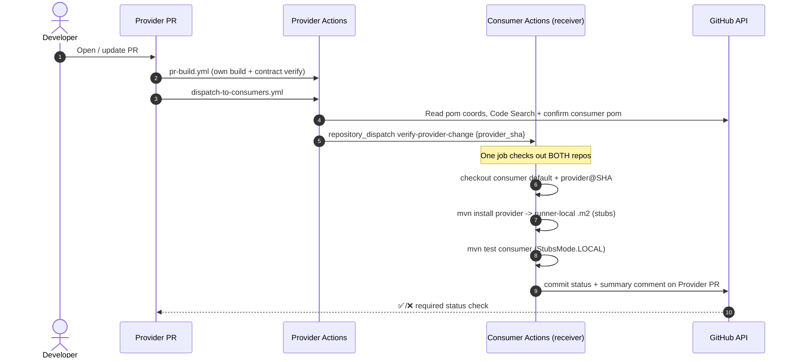

# demo-contract-provider

A minimal Spring Boot HTTP **provider** demonstrating automated cross-repository
contract-impact verification with **Spring Cloud Contract** (Groovy DSL), **no
broker** and **no artifact publishing**.

Endpoint:

```
GET /api/greetings/{name}  ->  200 {"message":"Hello {name}"}
```

- Java 21, Maven, Spring Boot 3.4.1, Spring Cloud 2024.0.0 (Contract 4.2.0).
- Static demo version: `1.0.0-SNAPSHOT` (never bumped per-PR).
- Groovy contract in `src/test/resources/contracts/greetings/`.
- Producer contract tests are **generated** from that contract; the `*-stubs.jar`
  is installed **only** into the runner-local Maven repository.

## What the demo proves / does not prove

**Proves:** When a provider PR changes the contract-relevant behaviour (e.g.
renames the `message` field), an automated GitHub Actions flow builds the exact
PR commit and runs the **real consumer tests** against the resulting stubs,
reporting pass/fail back on the PR — with no developer-run Maven commands after
the PR is raised, and no artifacts published anywhere.

**Does not prove:** That every consumer everywhere is discovered (discovery is
best-effort — see below), nor that runtime concerns beyond the contract (auth,
performance, Kafka, etc.) are safe. Installing a JAR and running a build is *not*
verification; the workflows explicitly run the changed consumer's tests.

## Architecture / PR verification flow



## Local test instructions

```bash
# Build, generate + verify contract tests, install stubs into local .m2
mvn clean install

# Confirm the generated producer contract test exists
find target/generated-test-sources -name '*.java'

# Confirm the stubs jar was installed locally (nothing is published remotely)
find ~/.m2/repository/com/example/demo/demo-contract-provider -name '*stubs*.jar'
```

To use an ephemeral, runner-local repository (as CI does):

```bash
mvn clean install -Dmaven.repo.local=/tmp/m2
```

## Breaking-change demonstration

Rename the contract-relevant field and watch consumer verification fail:

1. In `src/main/java/com/example/provider/Greeting.java` rename `message` → `content`.
2. In `src/test/resources/contracts/greetings/shouldReturnGreeting.groovy` change
   `message:` → `content:` and update the provider's own tests.
3. `mvn clean install` — stubs now emit `{"content":...}`.
4. The consumer's `GreetingClientStubRunnerTest` (which expects `message`) fails.

Restore the field to return to green.

## Workflows

| File | Trigger | Purpose |
|------|---------|---------|
| `pr-build.yml` | `pull_request`, `workflow_dispatch` | Own build + contract verification; installs stubs into runner-local `.m2`. |
| `dispatch-to-consumers.yml` | `pull_request`, `workflow_dispatch` | Discover consumers of the provider coords and dispatch verification. |
| `verify-consumer-change.yml` | `repository_dispatch: verify-consumer-change`, `workflow_dispatch` | Receiver for the **consumer PR flow**: build provider stubs locally, run the changed consumer's tests, report to consumer PR. |

`workflow_dispatch` inputs on the receiver let you replay any verification
manually for demos/troubleshooting.

## GitHub App / PAT setup

Production design uses a **GitHub App** installed on both repos. A fine-grained
**PAT** is documented as a demo-only fallback.

### Required GitHub App permissions (verify against current GitHub docs)

| Scope | Access | Why |
|-------|--------|-----|
| **Metadata** | Read | Always required. |
| **Contents** | Read + write | `Contents: write` is required to create a `repository_dispatch` event; read is required to check out code. |
| **Commit statuses** | Read + write | Post the branch-protection status check. |
| **Pull requests** | Read + write | Create/update the single summary comment. |
| **Checks** | Write | Only if you switch reporting to Check Runs instead of commit statuses. |

> Verified: *Create a repository dispatch event* requires `Contents: write` for
> fine-grained tokens / GitHub Apps
> (https://docs.github.com/en/rest/repos/repos#create-a-repository-dispatch-event).
> Confirm the others against the current REST docs before enabling in production.

### Repository variables and secrets

| Name | Kind | Used by | Notes |
|------|------|---------|-------|
| `APP_ID` | Variable | dispatch + receiver | GitHub App id. If empty, PAT fallback is used. |
| `PARTNER_REPO` | Variable | discovery fallback | `owner/demo-contract-consumer`. Deterministic partner when Code Search is cold. |
| `APP_PRIVATE_KEY` | Secret | dispatch + receiver | GitHub App private key (PEM). |
| `DISPATCH_PAT` | Secret | fallback | Fine-grained PAT with the permissions above, demo only. |

## Dependency discovery (and its limits)

Discovery is **automated** but **not authoritative**:

- GitHub **dependency graph** can identify supported Maven relationships.
- GitHub **Code Search** finds Maven coordinates / Stub Runner ids, but is
  text-based, may have indexing delay, and is not guaranteed complete.
- HTTP calls, Kafka topics, runtime, dynamically-constructed, and test-only
  relationships may not appear.
- Every candidate is confirmed by reading its `pom.xml`; `PARTNER_REPO` gives a
  deterministic fallback.
- Production likely needs a **generated typed service graph** with a small,
  audited manual override for relationships that cannot be inferred.

## Security model / limitations

- Runs only for same-repo PRs; **fork PRs never receive credentials**.
- Payloads are **validated** (`^[0-9a-f]{40}$` SHA, `owner/name` repo, numeric PR)
  to prevent repository/command injection.
- Cross-repo builds always use the **originating PR SHA**, never an untrusted
  branch name.
- Least-privilege `permissions:`, per-job `timeout-minutes`, and `concurrency`
  groups that cancel superseded runs.
- App tokens are scoped to just the two repositories involved.

## Troubleshooting

- **`StubNotFoundException`**: the provider wasn't installed into the job `.m2`,
  or `provider.stubs.version` doesn't match. Check the install step logs.
- **Discovery found nothing**: set `PARTNER_REPO`, or use the receiver's
  `workflow_dispatch` inputs to run verification manually.
- **Dispatch 404/403**: token lacks `Contents: write`, or the App isn't installed
  on the target repo.
- **No status on PR**: `Commit statuses: write` missing, or the reporting token
  can't see the originating repo.

## Remote setup (run yourself — not done automatically)

```bash
cd demo-contract-provider
git init && git add . && git commit -m "Initial provider demo"
gh repo create demo-contract-provider --private --source=. --remote=origin --push
# Variables / secrets:
gh variable set PARTNER_REPO --body "<you>/demo-contract-consumer"
gh variable set APP_ID       --body "<app-id>"
gh secret   set APP_PRIVATE_KEY < app-private-key.pem
# Demo-only PAT fallback:
gh secret   set DISPATCH_PAT  --body "<fine-grained-pat>"
# Branch protection: require the 'contract-verification/consumer' status check.
```
